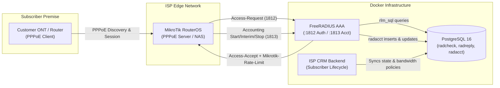

# MikroTik RouterOS Configuration Guide for FreeRADIUS AAA Integration

This guide provides step-by-step instructions for integrating **MikroTik RouterOS** (Physical RouterBOARD, Cloud Hosted Router / CHR, GNS3, or EVE-NG) with the **ISP CRM FreeRADIUS AAA Server**.

---

## 1. Architecture Overview



---

## 2. Network & AAA Connection Parameters

| Parameter | Development Value | Production / Real Router |
| :--- | :--- | :--- |
| **FreeRADIUS Host IP** | `10.0.2.2` (VirtualBox/QEMU) or `<DOCKER_HOST_LAN_IP>` | Dedicated Server IP (e.g. `10.10.10.10`) |
| **Authentication Port** | `1812` (UDP) | `1812` (UDP) |
| **Accounting Port** | `1813` (UDP) | `1813` (UDP) |
| **CoA / Disconnect Port** | `3799` (UDP) | `3799` (UDP) |
| **Shared RADIUS Secret** | `testing123` | Strong randomly generated secret |
| **NAS Identifier / IP** | `127.0.0.1` or `<ROUTER_LOOPBACK_IP>` | Router Loopback IP |

---

## 3. RouterOS Configuration Commands (Terminal / SSH / WinBox)

Run the following commands in the MikroTik RouterOS terminal:

### Step 1: Add FreeRADIUS Server
```routeros
/radius
add address=192.168.1.100 \
    service=ppp \
    authentication-port=1812 \
    accounting-port=1813 \
    secret="testing123" \
    timeout=3000ms \
    comment="ISP-CRM-FreeRADIUS"
```
*(Replace `192.168.1.100` with the IP address of your host machine running Docker).*

---

### Step 2: Configure IP Pool for PPPoE Subscribers
```routeros
/ip pool
add name=pool-pppoe ranges=100.64.10.10-100.64.10.250
```

---

### Step 3: Configure PPP Profile to Use RADIUS & Accounting
```routeros
/ppp profile
set [ find default=yes ] \
    local-address=100.64.10.1 \
    remote-address=pool-pppoe \
    use-encryption=yes \
    only-one=yes \
    use-radius=yes \
    dns-server=1.1.1.1,8.8.8.8

/ppp profile
add name=pppoe-radius-profile \
    local-address=100.64.10.1 \
    remote-address=pool-pppoe \
    use-encryption=yes \
    only-one=yes \
    use-radius=yes \
    dns-server=1.1.1.1,8.8.8.8
```

---

### Step 4: Configure PPPoE Server
Bind the PPPoE server to the subscriber-facing interface (e.g. `ether2` or VLAN):
```routeros
/interface pppoe-server server
add service-name=isp-broadband \
    interface=ether2 \
    max-mtu=1492 \
    max-mru=1492 \
    mrru=disabled \
    authentication=pap,chap,mschap2 \
    default-profile=pppoe-radius-profile \
    one-session-per-host=yes \
    keepalive-timeout=60 \
    disabled=no
```

---

### Step 5: Enable RADIUS Incoming (CoA / Disconnect Requests)
Allows the CRM application to instantly terminate or update subscriber sessions upon expiry or plan upgrade:
```routeros
/radius incoming
set accept=yes port=3799
```

---

### Step 6: Enable RADIUS Debug Logging (Optional for Development)
```routeros
/system logging
add topics=radius,debug action=memory
```

---

## 4. Application Plan to MikroTik Rate-Limit Mapping

FreeRADIUS sends the `Mikrotik-Rate-Limit` attribute back in the `Access-Accept` response based on the subscriber's assigned plan.

In RouterOS:
- **`rx` (Receive)** = Traffic entering the router from subscriber (**Upload**)
- **`tx` (Transmit)** = Traffic leaving the router to subscriber (**Download**)

Syntax:
```text
rx-rate[/tx-rate] [rx-burst-rate/tx-burst-rate rx-burst-threshold/tx-burst-threshold rx-burst-time/tx-burst-time [priority]]
```

### Mapping Examples

| Plan Name | Speed (Down / Up) | RADIUS `Mikrotik-Rate-Limit` Attribute | RouterOS Dynamic Simple Queue |
| :--- | :--- | :--- | :--- |
| **Fiber Starter 50M** | 50 Mbps down / 25 Mbps up | `25M/50M` | Max Limit: `25M/50M` |
| **Fiber Standard 100M** | 100 Mbps down / 50 Mbps up | `50M/100M` | Max Limit: `50M/100M` |
| **Fiber Ultra 200M** | 200 Mbps down / 100 Mbps up | `100M/200M` | Max Limit: `100M/200M` |
| **With Burst (100M Plan)** | 100M down / 50M up, 150M burst | `50M/100M 75M/150M 60M/120M 10/10 8` | Rate + Burst + Threshold + Time |
| **Suspended / Expired** | Disabled | *(Rejected with `Access-Reject`)* | No session allowed |

---

## 5. Pre-Seeded Development Test Users

Use these accounts to test PPPoE dial-in from a test PC or MikroTik PPPoE client:

| Username | Password | Assigned Plan | Status | Expected RADIUS Result |
| :--- | :--- | :--- | :--- | :--- |
| `speed_50m_user` | `pass123` | 50 Mbps | `ACTIVE` | **Access-Accept** (`25M/50M`) |
| `speed_100m_user` | `pass123` | 100 Mbps | `ACTIVE` | **Access-Accept** (`50M/100M`) |
| `speed_200m_user` | `pass123` | 200 Mbps | `ACTIVE` | **Access-Accept** (`100M/200M`) |
| `suspended_user` | `pass123` | 100 Mbps | `SUSPENDED` | **Access-Reject** (Auth Failed) |
| `expired_user` | `pass123` | 50 Mbps | `EXPIRED` | **Access-Reject** (Auth Failed) |

To re-seed test users at any time:
```powershell
node apps/api/scripts/seed-radius-test-users.mjs
```

---

## 6. Verification Commands in RouterOS

Check status in RouterOS via terminal or WinBox:

### 1. View Active PPPoE Sessions
```routeros
/interface pppoe-server print
```

### 2. Verify Dynamic Rate-Limit Queues Created by RADIUS
```routeros
/queue simple print
```
*You should see automatically created dynamic queues (`<pppoe-user>`) with `max-limit` matching `25M/50M`, `50M/100M`, etc.*

### 3. Check RADIUS Telemetry & Statistics
```routeros
/radius print stats
```

### 4. Inspect Live RADIUS Transactions
```routeros
/log print where topics~"radius"
```
