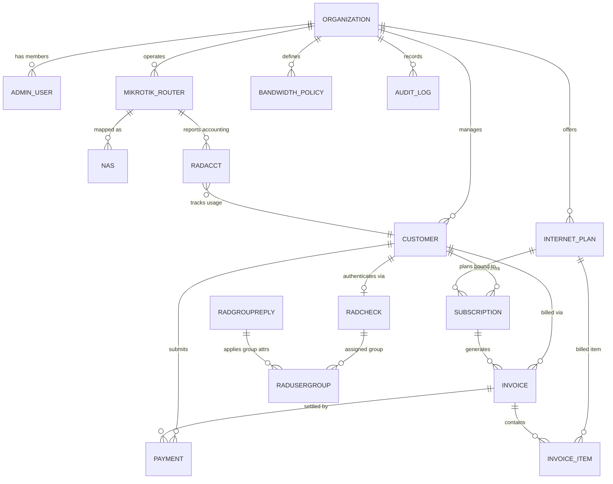

# Database Architecture & Schema Specification

## 1. Overview

The storage layer uses **PostgreSQL 16** orchestrated through **Prisma ORM** (`packages/database`). It hosts two interconnected logical schemas within a single database instance:

1. **ISP CRM Application Schema**: Multi-tenant relational model covering Organizations, Admin Users, Customers, Internet Plans, Subscriptions, Invoices, Payments, MikroTik Routers, and Audit Logs.
2. **FreeRADIUS 3.x Native Schema (`rlm_sql`)**: Standard RFC-compliant RADIUS tables (`radcheck`, `radreply`, `radgroupcheck`, `radgroupreply`, `radusergroup`, `radacct`, `nas`) directly queried and updated by the FreeRADIUS daemon.

This co-location architecture eliminates cross-service synchronization delays: when an administrator creates a subscriber or updates their plan in the CRM, the changes are written directly to `radcheck` and `radreply` within the same database transaction.

---

## 2. Entity Relationship Diagram (ERD)



---

## 3. CRM Domain Entities

### 3.1 Organization (Tenants)
Represents an individual ISP business operating as an independent tenant.

```prisma
model Organization {
  id              String            @id @default(uuid())
  name            String
  slug            String            @unique
  legalName       String?
  gstin           String?           // Indian GST Identification Number (15 chars)
  email           String
  phone           String
  address         String?
  city            String?
  state           String?           // Indian State (e.g. Maharashtra, Karnataka)
  stateCode       String?           // 2-digit GST state code (e.g. "27" for MH)
  pincode         String?
  currency        String            @default("INR")
  timezone        String            @default("Asia/Kolkata")
  isActive        Boolean           @default(true)
  createdAt       DateTime          @default(now())
  updatedAt       DateTime          @updatedAt

  users           AdminUser[]
  customers       Customer[]
  plans           InternetPlan[]
  routers         MikrotikRouter[]
  policies        BandwidthPolicy[]
  auditLogs       AuditLog[]

  @@map("organizations")
}
```

### 3.2 Admin Users & Roles
Staff members who manage the ISP CRM operations.

```prisma
enum UserRole {
  SUPER_ADMIN
  ORG_ADMIN
  BILLING_OPERATOR
  NETWORK_ENGINEER
  SUPPORT_TECHNICIAN
}

model AdminUser {
  id              String        @id @default(uuid())
  organizationId  String
  name            String
  email           String
  passwordHash    String
  role            UserRole      @default(ORG_ADMIN)
  phone           String?
  isActive        Boolean       @default(true)
  lastLoginAt     DateTime?
  createdAt       DateTime      @default(now())
  updatedAt       DateTime      @updatedAt

  organization    Organization  @relation(fields: [organizationId], references: [id], onDelete: Cascade)
  auditLogs       AuditLog[]

  @@unique([organizationId, email])
  @@index([organizationId])
  @@map("admin_users")
}
```

### 3.3 Customer (Subscribers)
End-user internet subscribers. PPPoE credentials map directly to the subscriber.

```prisma
enum CustomerStatus {
  LEAD
  ACTIVE
  SUSPENDED
  EXPIRED
  TERMINATED
}

model Customer {
  id              String          @id @default(uuid())
  organizationId  String
  customerCode    String          // e.g. "CUST-00102"
  name            String
  email           String?
  phone           String
  alternatePhone  String?
  installationAddress String
  pincode         String?
  aadhaarNumber   String?         // KYC compliance (masked/encrypted in production)
  gstin           String?         // For B2B customers claiming input tax credit

  // PPPoE Network Identity
  pppoeUsername   String          @unique
  pppoePassword   String          // Synchronized with radcheck
  staticIp        String?
  macAddress      String?         // Calling-Station-Id lock if needed
  
  status          CustomerStatus  @default(ACTIVE)
  createdAt       DateTime        @default(now())
  updatedAt       DateTime        @updatedAt

  organization    Organization    @relation(fields: [organizationId], references: [id], onDelete: Cascade)
  subscriptions   Subscription[]
  invoices        Invoice[]
  payments        Payment[]

  @@unique([organizationId, customerCode])
  @@index([organizationId, status])
  @@index([pppoeUsername])
  @@map("customers")
}
```

### 3.4 Internet Plan & Bandwidth Policy
Package offerings defining download/upload speeds, burst limits, and GST rate.

```prisma
model InternetPlan {
  id                String            @id @default(uuid())
  organizationId    String
  name              String            // e.g. "Fiber 100 Mbps Unlimited"
  code              String            // e.g. "FIBER-100M"
  downloadSpeedMbps Int               // e.g. 100
  uploadSpeedMbps   Int               // e.g. 100
  validityDays      Int               @default(30)
  price             Decimal           @db.Decimal(10, 2) // Base price without GST
  gstRatePercent    Decimal           @default(18.0) @db.Decimal(5, 2) // 18% standard GST for Telecom
  hsnSacCode        String            @default("998422") // SAC code for Internet Telecommunication Services
  dataLimitGb       Int?              // Fair Usage Policy (FUP) limit; null = Unlimited
  fupDownloadSpeedMbps Int?           // Throttle speed after FUP
  fupUploadSpeedMbps   Int?

  // MikroTik Burst Settings
  burstDownloadMbps Int?
  burstUploadMbps   Int?
  burstThresholdMbps Int?
  burstTimeSecs     Int?

  isActive          Boolean           @default(true)
  createdAt         DateTime          @default(now())
  updatedAt         DateTime          @updatedAt

  organization      Organization      @relation(fields: [organizationId], references: [id], onDelete: Cascade)
  subscriptions     Subscription[]

  @@unique([organizationId, code])
  @@index([organizationId, isActive])
  @@map("internet_plans")
}

model BandwidthPolicy {
  id              String            @id @default(uuid())
  organizationId  String
  name            String            // e.g. "Peak Evening Throttle"
  rateLimitString String            // MikroTik format: "rx-rate[/tx-rate] [rx-burst-rate[/tx-burst-rate] ...]"
  priority        Int               @default(8)
  createdAt       DateTime          @default(now())
  updatedAt       DateTime          @updatedAt

  organization    Organization      @relation(fields: [organizationId], references: [id], onDelete: Cascade)

  @@unique([organizationId, name])
  @@map("bandwidth_policies")
}
```

### 3.5 Subscriptions
Binds a customer to an Internet Plan for a duration.

```prisma
enum SubscriptionStatus {
  PENDING
  ACTIVE
  EXPIRED
  SUSPENDED
  CANCELLED
}

model Subscription {
  id              String              @id @default(uuid())
  organizationId  String
  customerId      String
  planId          String
  status          SubscriptionStatus  @default(ACTIVE)
  startDate       DateTime            @default(now())
  endDate         DateTime
  autoRenew       Boolean             @default(true)
  createdAt       DateTime            @default(now())
  updatedAt       DateTime            @updatedAt

  customer        Customer            @relation(fields: [customerId], references: [id], onDelete: Cascade)
  plan            InternetPlan        @relation(fields: [planId], references: [id])
  invoices        Invoice[]

  @@index([organizationId, status])
  @@index([customerId])
  @@index([endDate])
  @@map("subscriptions")
}
```

### 3.6 Invoices & Invoice Items (Indian GST Compliant)

```prisma
enum InvoiceStatus {
  DRAFT
  UNPAID
  PAID
  OVERDUE
  CANCELLED
}

model Invoice {
  id              String          @id @default(uuid())
  organizationId  String
  customerId      String
  subscriptionId  String?
  invoiceNumber   String          // e.g. "INV-2026-00042"
  invoiceDate     DateTime        @default(now())
  dueDate         DateTime
  subtotal        Decimal         @db.Decimal(10, 2)
  cgstAmount      Decimal         @default(0) @db.Decimal(10, 2) // Central GST (9% for intra-state)
  sgstAmount      Decimal         @default(0) @db.Decimal(10, 2) // State GST (9% for intra-state)
  igstAmount      Decimal         @default(0) @db.Decimal(10, 2) // Integrated GST (18% for inter-state)
  totalAmount     Decimal         @db.Decimal(10, 2)
  paidAmount      Decimal         @default(0) @db.Decimal(10, 2)
  status          InvoiceStatus   @default(UNPAID)
  notes           String?
  paidAt          DateTime?
  createdAt       DateTime        @default(now())
  updatedAt       DateTime        @updatedAt

  customer        Customer        @relation(fields: [customerId], references: [id], onDelete: Cascade)
  subscription    Subscription?   @relation(fields: [subscriptionId], references: [id], onDelete: SetNull)
  items           InvoiceItem[]
  payments        Payment[]

  @@unique([organizationId, invoiceNumber])
  @@index([organizationId, status])
  @@index([customerId])
  @@index([dueDate])
  @@map("invoices")
}

model InvoiceItem {
  id              String          @id @default(uuid())
  invoiceId       String
  description     String          // e.g. "Fiber 100 Mbps Unlimited (01/10/2026 - 31/10/2026)"
  sacCode         String          @default("998422")
  quantity        Int             @default(1)
  unitPrice       Decimal         @db.Decimal(10, 2)
  taxRatePercent  Decimal         @default(18.0) @db.Decimal(5, 2)
  taxAmount       Decimal         @db.Decimal(10, 2)
  totalAmount     Decimal         @db.Decimal(10, 2)

  invoice         Invoice         @relation(fields: [invoiceId], references: [id], onDelete: Cascade)

  @@index([invoiceId])
  @@map("invoice_items")
}
```

### 3.7 Payments

```prisma
enum PaymentMethod {
  CASH
  UPI
  BANK_TRANSFER
  ONLINE_GATEWAY
  CHEQUE
}

enum PaymentStatus {
  PENDING
  SUCCESS
  FAILED
  REFUNDED
}

model Payment {
  id              String          @id @default(uuid())
  organizationId  String
  customerId      String
  invoiceId       String?
  receiptNumber   String          // e.g. "RCPT-2026-00088"
  amount          Decimal         @db.Decimal(10, 2)
  paymentMethod   PaymentMethod   @default(CASH)
  status          PaymentStatus   @default(SUCCESS)
  transactionRef  String?         // UPI UTR number or bank transaction ID
  collectedById   String?         // Admin user who collected the payment
  paidAt          DateTime        @default(now())
  notes           String?
  createdAt       DateTime        @default(now())
  updatedAt       DateTime        @updatedAt

  customer        Customer        @relation(fields: [customerId], references: [id], onDelete: Cascade)
  invoice         Invoice?        @relation(fields: [invoiceId], references: [id], onDelete: SetNull)

  @@unique([organizationId, receiptNumber])
  @@index([organizationId, status])
  @@index([customerId])
  @@index([invoiceId])
  @@map("payments")
}
```

### 3.8 MikroTik Routers

```prisma
enum RouterStatus {
  ONLINE
  OFFLINE
  UNREACHABLE
  ERROR
}

model MikrotikRouter {
  id              String          @id @default(uuid())
  organizationId  String
  name            String          // e.g. "Main BNG - Sector 4"
  ipAddress       String          // Router Management IP
  radiusSecret    String          // Shared secret configured in /radius
  apiPort         Int             @default(8728) // RouterOS API port
  apiUsername     String?
  apiPassword     String?
  coaPort         Int             @default(3799) // RFC 3576 / 5176 Incoming CoA Port
  status          RouterStatus    @default(ONLINE)
  lastSeenAt      DateTime?
  model           String?         // e.g. "CCR2004-16G-2S+"
  rosVersion      String?         // e.g. "7.15"
  createdAt       DateTime        @default(now())
  updatedAt       DateTime        @updatedAt

  organization    Organization    @relation(fields: [organizationId], references: [id], onDelete: Cascade)

  @@unique([organizationId, ipAddress])
  @@index([organizationId])
  @@map("mikrotik_routers")
}
```

### 3.9 Audit Logs

```prisma
enum AuditAction {
  CREATE
  UPDATE
  DELETE
  LOGIN
  LOGOUT
  SUSPEND_SUBSCRIBER
  REACTIVATE_SUBSCRIBER
  COA_DISCONNECT
  COLLECT_PAYMENT
  GENERATE_INVOICE
}

model AuditLog {
  id              String          @id @default(uuid())
  organizationId  String
  adminUserId     String?
  action          AuditAction
  entityType      String          // e.g. "Customer", "Subscription", "Payment"
  entityId        String?
  details         Json?           // Structured diff or metadata
  ipAddress       String?
  userAgent       String?
  createdAt       DateTime        @default(now())

  organization    Organization    @relation(fields: [organizationId], references: [id], onDelete: Cascade)
  adminUser       AdminUser?      @relation(fields: [adminUserId], references: [id], onDelete: SetNull)

  @@index([organizationId, createdAt])
  @@index([entityType, entityId])
  @@map("audit_logs")
}
```

---

## 4. FreeRADIUS 3 Native Tables (`rlm_sql`)

These tables are defined with exact column names expected by FreeRADIUS PostgreSQL SQL driver:

```prisma
model RadCheck {
  id        Int       @id @default(autoincrement())
  username  String    @default("")
  attribute String    @default("")
  op        String    @default("==") @db.Char(2)
  value     String    @default("")

  @@index([username])
  @@map("radcheck")
}

model RadReply {
  id        Int       @id @default(autoincrement())
  username  String    @default("")
  attribute String    @default("")
  op        String    @default("=") @db.Char(2)
  value     String    @default("")

  @@index([username])
  @@map("radreply")
}

model RadUserGroup {
  id        Int       @id @default(autoincrement())
  username  String    @default("")
  groupname String    @default("")
  priority  Int       @default(1)

  @@index([username])
  @@map("radusergroup")
}

model RadGroupCheck {
  id        Int       @id @default(autoincrement())
  groupname String    @default("")
  attribute String    @default("")
  op        String    @default("==") @db.Char(2)
  value     String    @default("")

  @@index([groupname])
  @@map("radgroupcheck")
}

model RadGroupReply {
  id        Int       @id @default(autoincrement())
  groupname String    @default("")
  attribute String    @default("")
  op        String    @default("=") @db.Char(2)
  value     String    @default("")

  @@index([groupname])
  @@map("radgroupreply")
}

model RadAcct {
  radacctid             BigInt    @id @default(autoincrement())
  acctsessionid         String    @default("")
  acctuniqueid          String    @unique @default("")
  username              String    @default("")
  realm                 String?   @default("")
  nasipaddress          String    @default("")
  nasportid             String?   @default("")
  nasporttype           String?   @default("")
  acctstarttime         DateTime?
  acctupdatetime        DateTime?
  acctstoptime          DateTime?
  acctinterval          Int?
  acctsessiontime       BigInt?
  acctauthentic         String?
  connectinfo_start     String?
  connectinfo_stop      String?
  acctinputoctets       BigInt?
  acctoutputoctets      BigInt?
  calledstationid       String    @default("")
  callingstationid      String    @default("")
  acctterminatecause    String    @default("")
  servicetype           String?
  framedprotocol        String?
  framedipaddress       String    @default("")

  @@index([username])
  @@index([framedipaddress])
  @@index([acctsessionid])
  @@index([acctstarttime])
  @@index([acctstoptime])
  @@index([nasipaddress])
  @@map("radacct")
}

model Nas {
  id          Int       @id @default(autoincrement())
  nasname     String    @unique // IP or hostname of MikroTik router
  shortname   String?
  type        String    @default("other")
  ports       Int?
  secret      String    // RADIUS secret shared with MikroTik
  server      String?
  community   String?
  description String?

  @@map("nas")
}
```

---

## 5. Indexing & High-Volume Performance Considerations

1. **Accounting Table (`radacct`) Partitioning (Post-MVP Optimization)**:
   - In production, `radacct` accumulates millions of rows per month.
   - For the 7-day MVP, composite B-tree indices on `(username, acctstoptime)` and `(acctsessionid)` maintain sub-10ms queries for active session lookups.
   - PostgreSQL native range partitioning by `acctstarttime` (monthly) is scheduled for high-scale deployment.

2. **Tenant Scoping Guard Indices**:
   - Every multi-tenant query filters by `organizationId`.
   - All tenant-scoped tables feature composite indices combining `[organizationId, status]` and `[organizationId, createdAt]`, ensuring index-only scans for dashboard aggregation and paginated CRM tables.
